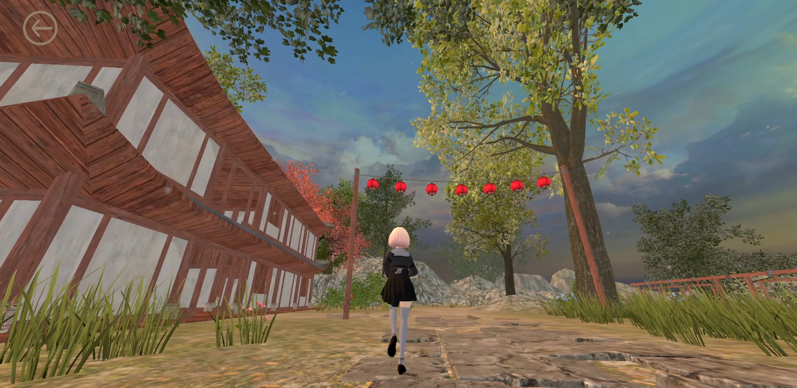

# Song rhyme and china culture show

## Overview
This project is a Unity-based interactive application developed as a personal / academic project.
Users can freely explore the environment, interact with UI elements, and view embedded multimedia content.
The project focuses on basic first-person interaction, UI navigation, and video-based content presentation.

## Features
- First-person movement and camera control
- Interactive UI buttons for accessing additional content
- Integrated video playback with skip functionality
- Clear navigation flow between different sections

## Controls & Interaction
- **Movement**: Use **W / A / S / D** keys to move.
- **Camera**: Move the **mouse** to control the camera view.
- **Interaction**: Click UI buttons using the **left mouse button** to access more content.
- **Mouse Control**: Press **ESC** to lock or release the mouse cursor.

## Navigation
- **Back Button**: Located at the **top-left corner** of the screen.
- **Skip Video**: A button in the **bottom-right corner** allows users to skip video playback.
- In **Section 4, Module 3**, the application can be exited directly using the **bottom-right button** during video playback.

## Tech Stack
- Unity 2022 LTS
- C#
- TextMeshPro
- Autodesk 3ds max

## How to Run
1. Open the project using **Unity Hub**.
2. Use **Unity 2022.x LTS**.
3. Press **Play** in the Unity Editor.

## Demo
- Video: https://www.youtube.com/watch?v=-LuCbVn03BY
- Screenshots: 
 
## Notes
This repository contains the Unity project source files only.
Generated folders such as `Library` and build outputs are excluded.
If you need unitypackage resource, please check:
https://drive.google.com/file/d/1Xp_mXEytf5eN1QzAHPDwAiev63xYC6IM/view?usp=sharing

